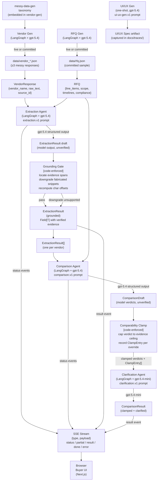

# AI Pipeline Architecture

This diagram shows the agent pipeline from input to final buyer-facing output.

## Reliability Guarantees (code-enforced, not model-asserted)

| Step | What code enforces |
|------|-------------------|
| **Grounding Gate** | Evidence snippets are located in the source text (fuzzy threshold 90%). Snippets that cannot be found are downgraded to `unsupported`. Model-supplied `char_start`/`char_end` are discarded and recomputed. |
| **Comparability Clamp** | Vendor × dimension verdicts are capped by a ceiling derived from the `FlagStatus` values in the `ExtractionResult`. A vendor with `missing` fields on a dimension cannot be `comparable` on that dimension, regardless of what the model proposed. Every override is recorded as a `ClampEntry` visible in the Prompt Trace screen. |
| **Structured output** | Both agents use the OpenAI structured-output / JSON-schema path with pydantic models. The schema enforces the `Field[T]` envelope on every extracted value — a model that omits a required field causes a validation error, not a silent null. |
| **SSE streaming** | Agent work streams to the browser as it completes. Status events ("Aligning to RFQ… Extracting fields… Grounding evidence…") give the buyer live progress. An `error` event surfaces failures explicitly — never a blank screen or a fabricated result. |

## Prompt Pack Summary

| Prompt | Model tier | Job |
|--------|-----------|-----|
| `rfq-gen.v1` | gpt-5.4 | Generate one realistic marketing-services RFQ |
| `vendor-gen.v1` | gpt-5.4 | Generate a deliberately messy vendor response |
| `messy-data-gen.v1` | — (embedded taxonomy) | Defines 8 mess types injected by vendor-gen |
| `ui-ux-gen.v1` | gpt-5.4 | Generate buyer UI spec (one-shot artifact capture) |
| `extraction.v1` | gpt-5.4 | Extract structured facts with evidence and flag states |
| `comparison.v1` | gpt-5.4 | Compare vendors across 6 dimensions; comparability first |
| `clarification.v1` | gpt-5.4-mini | Draft buyer clarification questions for flagged fields |
