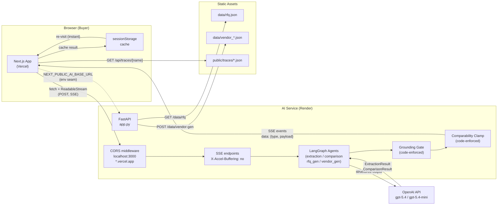

# System Architecture

This diagram shows the deployment topology and runtime data flow for Bid Desk.

## Key Design Points

- **Deployment split:** Next.js deploys to Vercel (static + edge); the Python AI service deploys
  to Render (long-running, SSE-friendly). Never mix — Vercel serverless functions time out before
  a long extraction run completes.

- **CORS allowlist:** The AI service allows `http://localhost:3000` and all `*.vercel.app` origins.
  No wildcard — `allow_origin_regex` matches Vercel preview deployments without opening to all
  origins.

- **Proxy buffering disabled:** Render's nginx proxy would buffer SSE chunks into one response.
  The `X-Accel-Buffering: no` header on every SSE endpoint disables this, so buyers see live
  progress.

- **OpenAI key stays server-side:** The browser knows only `NEXT_PUBLIC_AI_BASE_URL`. The OpenAI
  API key never ships to the browser. The AI service owns all model calls.

- **Trace files served via Next.js route handler:** `GET /api/traces/[name]` reads from
  `public/traces/` with path sanitization (T-05-04-A). The Trace screen fetches these at render
  time as a Server Component — no client-side fetch loop needed.

- **Session cache:** `ExtractionResult` and `ComparisonResult` are cached in `sessionStorage`
  so re-visiting a screen is instant. Live results only run when the user triggers a new extraction
  or comparison.
